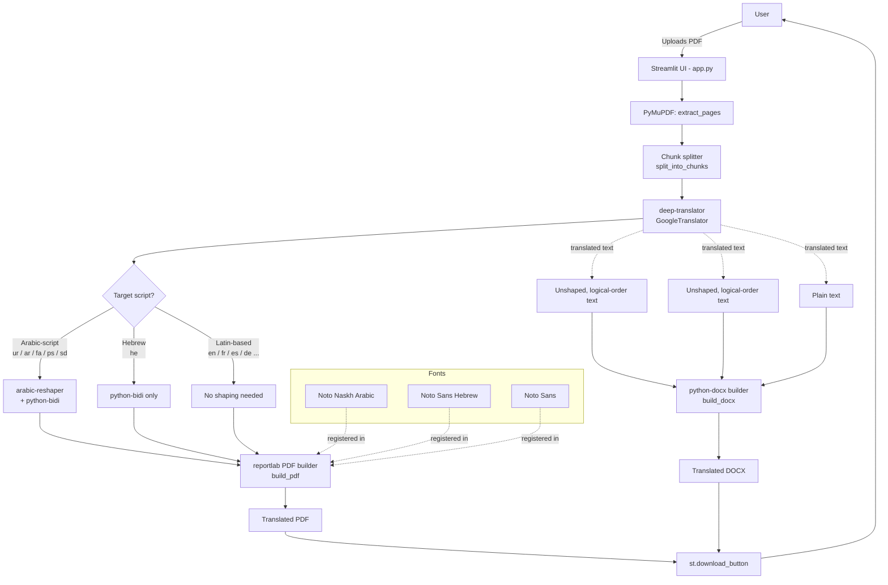

# PDF Translator

Upload a PDF, translate it into another language, and download the result as
**both a PDF and a DOCX** — fully in the browser, no API key required.

This started as a Hindi → Urdu Colab notebook and was rebuilt here as a
Streamlit app with a language picker, so it now supports any source language
translating into Urdu, Arabic, Persian, Pashto, Sindhi, Hebrew, or a handful
of Latin-based languages (English, French, Spanish, German, Portuguese,
Italian, Russian, Turkish).

---

## Features

- Upload any text-based PDF (scanned/image-only PDFs are detected and flagged — they need OCR first, which this app doesn't do)
- Free translation via Google Translate (through `deep-translator`, no API key, no billing)
- Correct **Arabic-script shaping + bidi reordering** for Urdu/Arabic/Persian/Pashto/Sindhi PDF output
- Correct **Hebrew bidi** rendering
- Outputs a properly tagged **RTL DOCX** (Word/LibreOffice handle their own shaping, so the DOCX text is stored in normal reading order with `w:rtl` and `w:bidi` flags set)
- Live progress bar while translating page by page
- One-click download of both the PDF and the DOCX

---

## Architecture



**Why two different text pipelines for PDF vs DOCX?**
`reportlab` has no built-in text-shaping engine, so Arabic-script and Hebrew
text must be pre-shaped (`arabic_reshaper`) and bidi-reordered (`python-bidi`)
before being drawn onto the canvas. Word and LibreOffice do their own
shaping internally, so feeding them already-reordered text would reverse it
twice — the DOCX path instead writes the **original, logical-order** text and
just marks the paragraph/run as right-to-left (`w:bidi`, `w:rtl`).

---

## Known limitations

- **Complex Indic/CJK scripts (Devanagari, Bengali, Tamil, Chinese, etc.) are not offered as *target* languages.** `reportlab` can't form conjuncts/ligatures for those scripts without an OpenType shaping engine, so PDF output would look broken. They're free to use as **source** languages, since source text is only sent to the translator and never rendered.
- **DOCX fonts are not embedded in the file.** `python-docx` has no font-embedding API, so the DOCX just *names* a font (e.g. "Noto Naskh Arabic"). If that font isn't installed on the machine opening the file, Word/LibreOffice will silently substitute a fallback font. Embedding fonts in DOCX would require manipulating the OOXML font table directly — out of scope here.
- **Translation uses the free, unofficial Google Translate web endpoint** (via `deep-translator`), the same one your browser uses — not the paid Cloud Translation API. It can be slow or temporarily rate-limited on very large documents; the app retries with backoff but there's no guaranteed SLA.
- **Scanned PDFs aren't supported.** If a PDF has no extractable text layer, the app flags it — running it through OCR (e.g. Tesseract) first is outside this app's scope.

---

## Project structure

```
.
├── app.py              # Streamlit app (UI + extraction + translation + PDF/DOCX builders)
├── requirements.txt     # Python dependencies
├── fonts/                # (optional) bundle .ttf files here to skip runtime download
└── README.md
```

---

## Run locally

```bash
git clone https://github.com/<your-username>/<your-repo>.git
cd <your-repo>
pip install -r requirements.txt
streamlit run app.py
```

The app will open at `http://localhost:8501`. The first run for each script
(Arabic-script / Hebrew / Latin) downloads its font once and caches it in
your OS temp directory.

> **Tip:** to avoid a runtime download (and to make the app fully offline-safe),
> create a `fonts/` folder next to `app.py` and drop in:
> - `NotoNaskhArabic-Regular.ttf`
> - `NotoSansHebrew-Regular.ttf`
> - `NotoSans-Regular.ttf`
>
> all available from [Google Noto Fonts](https://notofonts.github.io/). The app checks this folder before downloading anything.

---

## Deploy to Streamlit Community Cloud (via GitHub)

1. Push this repo to GitHub (must include `app.py` and `requirements.txt` at minimum).
2. Go to [share.streamlit.io](https://share.streamlit.io) and sign in with GitHub.
3. Click **New app**, select your repo/branch, and set the main file path to `app.py`.
4. Click **Deploy**. The first deploy installs dependencies and downloads fonts on first use — this can take a minute or two.
5. Future pushes to the connected branch redeploy automatically.

No secrets or API keys are required for this app.

---

## License

Add a license of your choice (e.g. MIT) before publishing. Note that the
bundled/downloaded **Noto fonts are licensed under the SIL Open Font
License**, which permits redistribution — keep their license file alongside
the fonts if you bundle them in `fonts/`.
